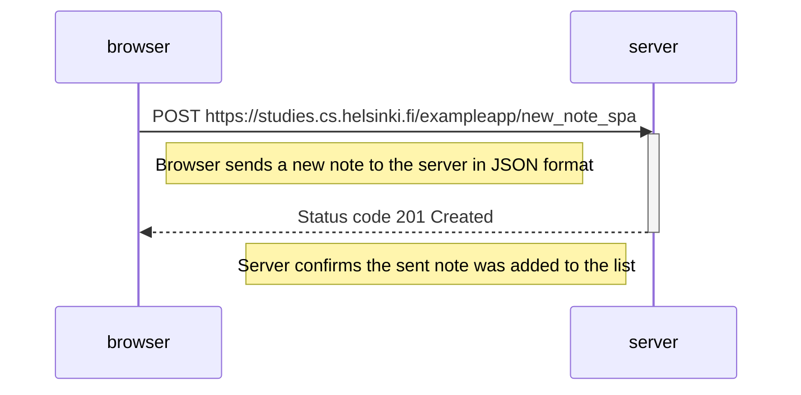

```mermaid
    sequenceDiagram
    participant browser
    participant server
    
    browser->>server: POST https://studies.cs.helsinki.fi/exampleapp/new_note_spa
    activate server

    Note right of browser: Browser sends a new note to the server in JSON format

    server-->>browser: Status code 201 Created
    deactivate server
    
    Note left of server: Server confirms the sent note was added to the list
```
