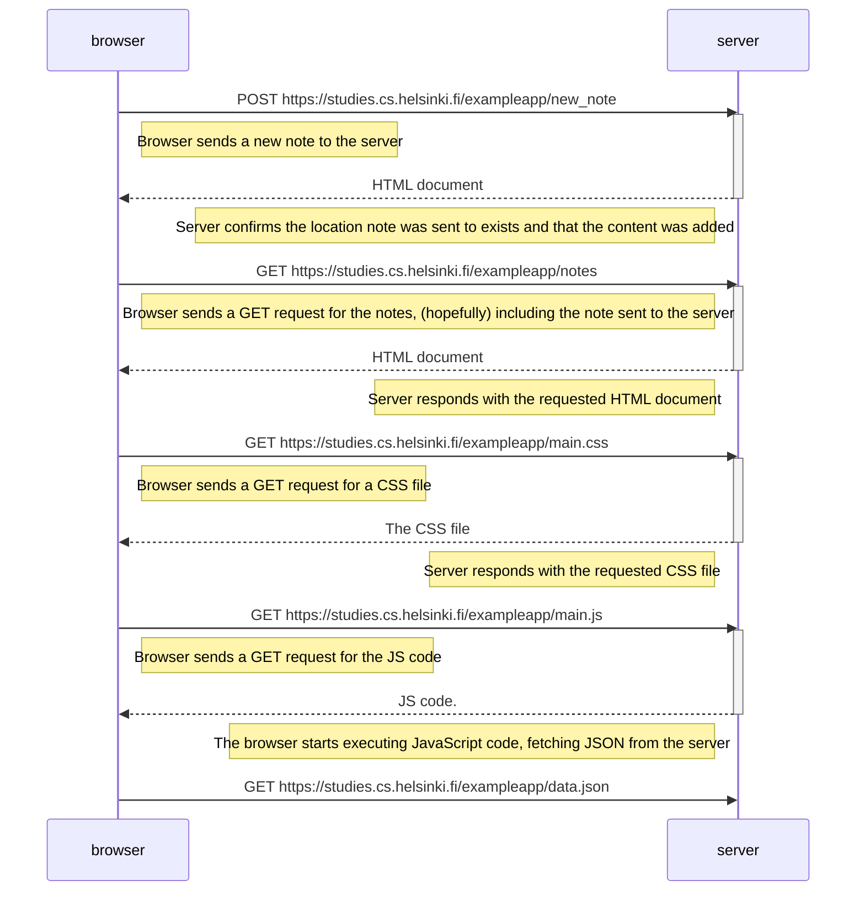

    Note right of browser: Browser sends a GET request for the JSON data

    server-->>browser: "content": "APP", "date": "2025-07-29T10:40:45.732Z"
    deactivate server
    Note left of server: The browser executes callback function that renders the notes
