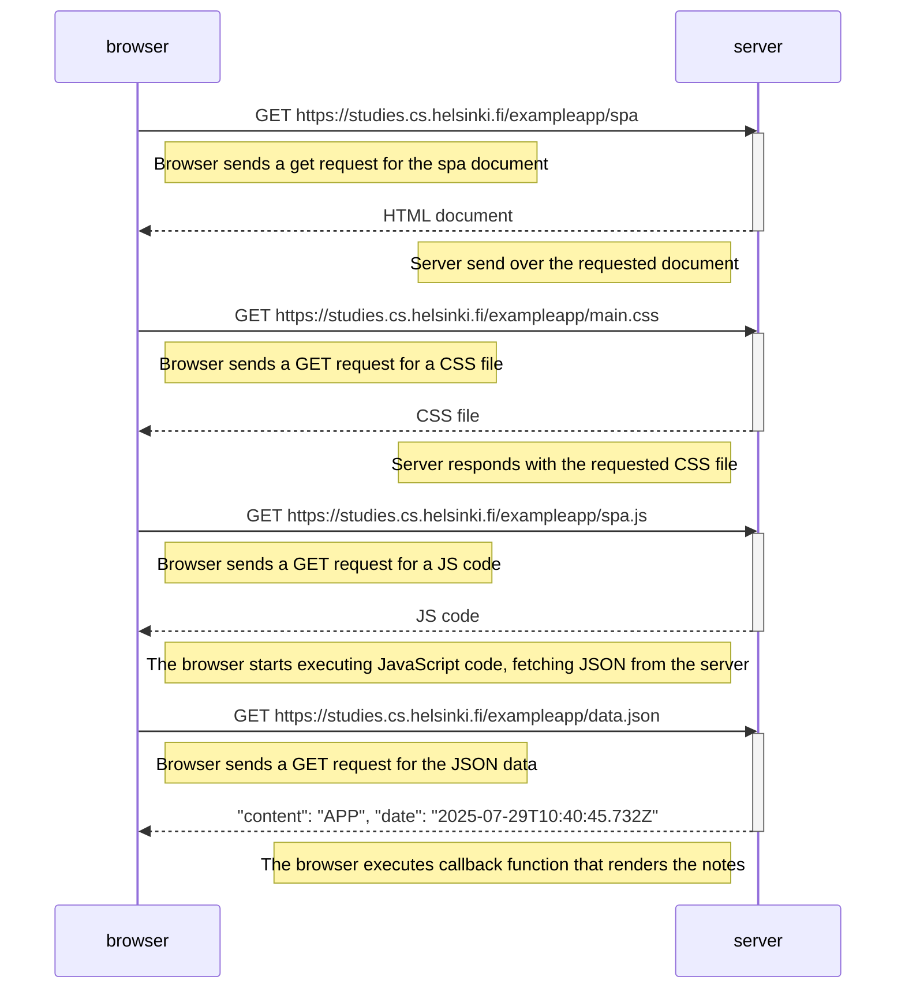

```mermaid
    sequenceDiagram
    participant browser
    participant server
    
    browser->>server: GET https://studies.cs.helsinki.fi/exampleapp/spa
    activate server

    Note right of browser: Browser sends a get request for the spa document

    server-->>browser: HTML document
    deactivate server
    
    Note left of server: Server send over the requested document

    browser->>server: GET https://studies.cs.helsinki.fi/exampleapp/main.css
    activate server

    Note right of browser: Browser sends a GET request for a CSS file

    server-->>browser: CSS file
    deactivate server

    Note left of server: Server responds with the requested CSS file
    
    browser->>server: GET https://studies.cs.helsinki.fi/exampleapp/spa.js
    activate server

    Note right of browser: Browser sends a GET request for a JS code

    server-->>browser: JS code
    deactivate server
    
    Note left of server: The browser starts executing JavaScript code, fetching JSON from the server
    
    browser->>server: GET https://studies.cs.helsinki.fi/exampleapp/data.json
    activate server

    Note right of browser: Browser sends a GET request for the JSON data

    server-->>browser: "content": "APP", "date": "2025-07-29T10:40:45.732Z"
    deactivate server

    Note left of server: The browser executes callback function that renders the notes
```
